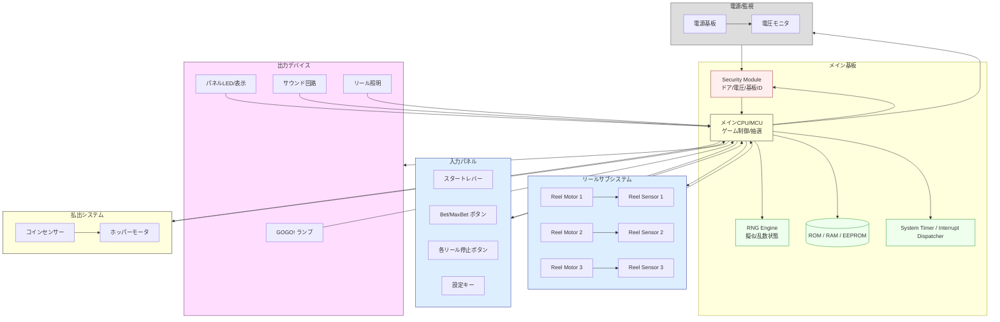

# パチスロ筐体 ハードウェア抽象ブロック図

以下はジャグラー系を参考にした一般的パチスロ機の抽象的な内部構成ブロック図です。シミュレータ実装時にクラス/モジュール分割を検討するためのたたき台となります。

## Mermaidブロック図

## データ/イベントフロー概要
- 入力イベント: IOPanel -> MCU (割り込み/ポーリング)。
- リール位置更新: ReelSensor -> MCU (角度/シンボル)。
- 抽選: MCU -> RNG (乱数取得) -> MCU (役成立判定)。
- ランプ/演出: MCU -> Outputs (優先度制御)。
- 払出: MCU -> Hopper (開始) / CoinSensor -> MCU (枚数フィードバック)。
- セキュリティ: Door/Voltageなど -> SEC -> MCU。基板ID照合は起動時 & 定期チェック。
- 永続データ: MCU <-> MEM (統計/設定)。
- タイマ/割り込み: TIMER -> MCU (周期ハートビート、リール通過イベント)。

## クラス設計候補 (抽象)
| 役割 | クラス案 | 主API例 |
|------|----------|---------|
| リール制御 | ReelMotor, ReelSensor | start(), stop(), get_position() |
| 乱数 | RNGEngine | next_uint32(), uniform(), weighted() |
| 入力 | InputPanel | poll(), events() |
| ランプ/表示 | LampController | set(pattern), priority() |
| 払出 | PayoutController | payout(target), status() |
| セキュリティ | SecurityModule | door_state(), voltage_ok(), board_id() |
| 永続 | MemoryStore | read_stats(), write_stats() |
| タイマ | SystemTimer | now(), schedule(callback, ms) |
| ゲーム進行 | GameCore | spin(), settle(), check_bonus() |

## 今後の拡張ポイント
- 通信IF (例: シリアル, ネットワーク) の抽象追加。
- 演出スクリプトエンジン (ランプ/サウンドパターン DSL)。
- 統計収集モジュール (BigData用途)。
- テストダブル (MockRNG, MockReelMotor) による再現性テスト。

---
シミュレータ実装前に API境界と責務分割をさらに詳細化していきます。追加要望があればコメントください。